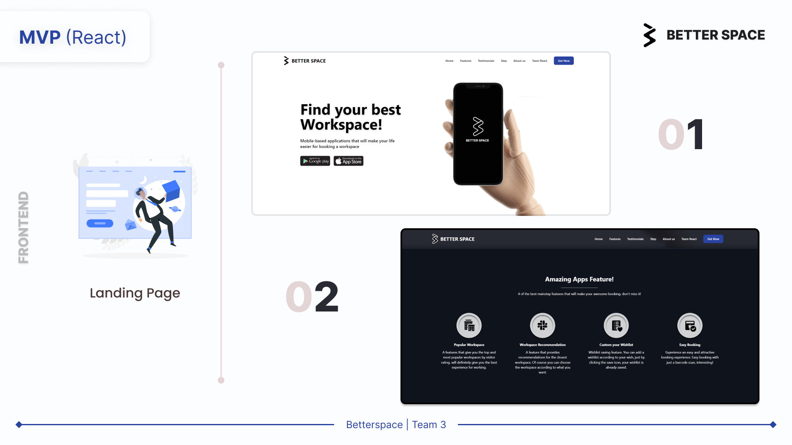
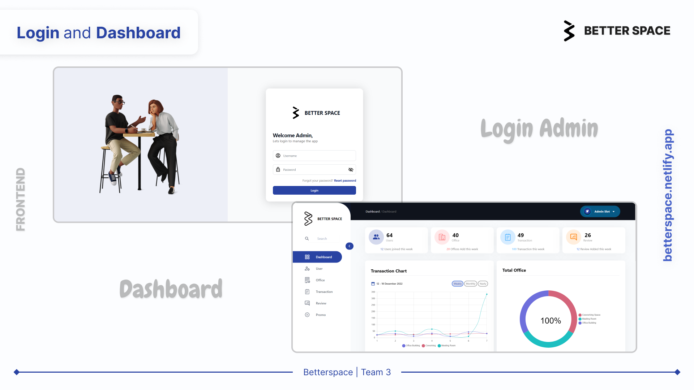
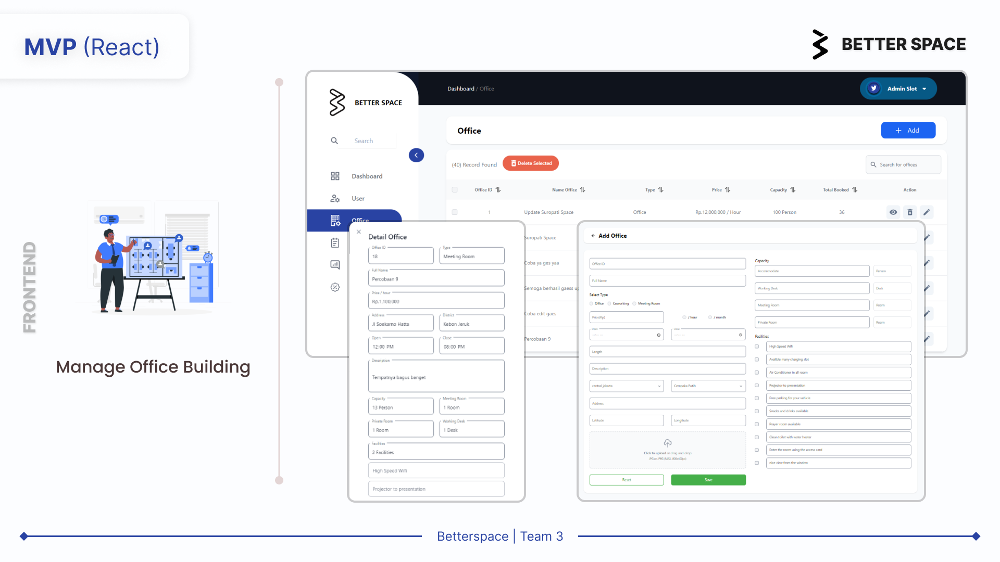
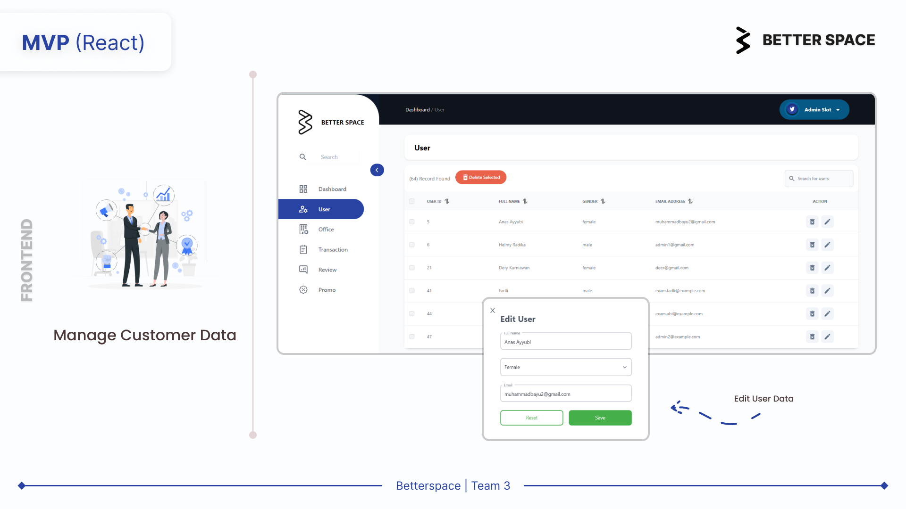
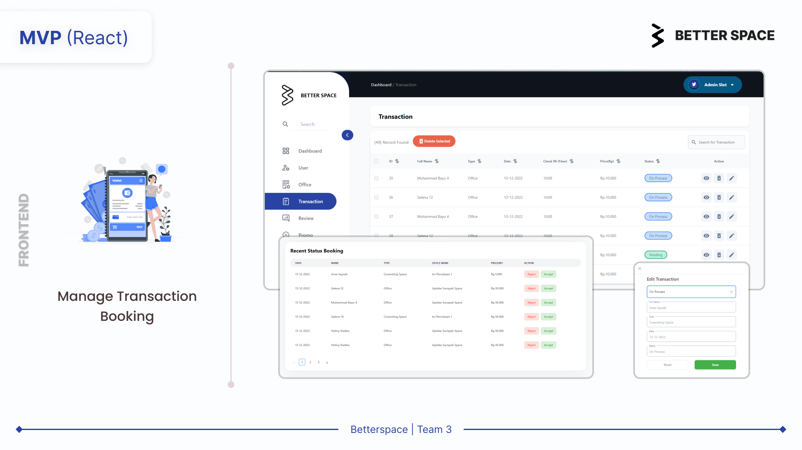
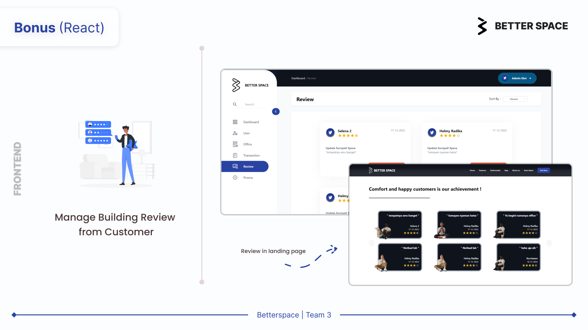
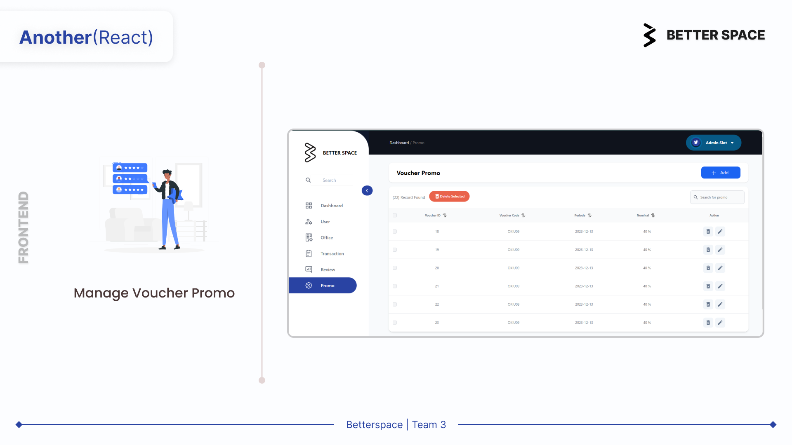

# Office Booking System

---

### `Introduction`

The goal of this project is to develop an web-based platform to rent office spaces across Jakarta. Office booking aims for the convenience of user when searching for a suitable working space in Jakarta’s business district areas.

It is also important for the business to manage its listings, customers, and marketing & negotiation history for managerial purposes.

### How to Run?

---

1. Clone this Project
2. type `code .`
3. Create .env files in the root of project
4. Setup `.env` files for base url of API. example:

```
REACT_APP_BASE_URL="base_url_yout_api"
```

5. On your Code editor, open terminal and then type `npm install`
6. Run the project by typing `npm start`
7. Happy Testing

### Feature

---

| Feature                        | Completed?         |
| ------------------------------ | ------------------ |
| Manage Office and Buildings    | :heavy_check_mark: |
| Manage Users Data              | :heavy_check_mark: |
| Manage Transaction Booking     | :heavy_check_mark: |
| Manage Review Building Reviews | :heavy_check_mark: |
| Manage Voucher                 | :heavy_check_mark: |

### Result Of this Project

1. **Landing Page**
   

2. **Dasboard and Login**
   

3. **Manage Office and Buildings**
   

4. **Manage Customer Data**
   

5. **Manage Transactions Booking**
   

6. **Manage Building Review**
   

7. **Manage Voucher Promo**
   

## Deployment Result

---

[Betterspace App](https://betterspace.netlify.app/)
